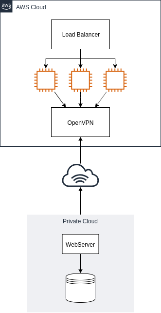

# cloud-hibrida
O projeto cria uma nuvem hibrida utilizando a AWS EC2 e Openstack.

O script e feito utilizando o Terraform para subir toda a infraestrutuda, essa consiste em um autoscaling para os webServers e um openVPN, em nuvem publica e um webServer e um banco de dados, em nuvem privada.



## Preparando o ambiente

- Baixar o terraform
  https://www.terraform.io/downloads.html
- Adicionar ao path

## Iniciando o terraform

- Adicionar sua chave publica em variables.tf

```
$ terraform init
$ terraform apply
```
